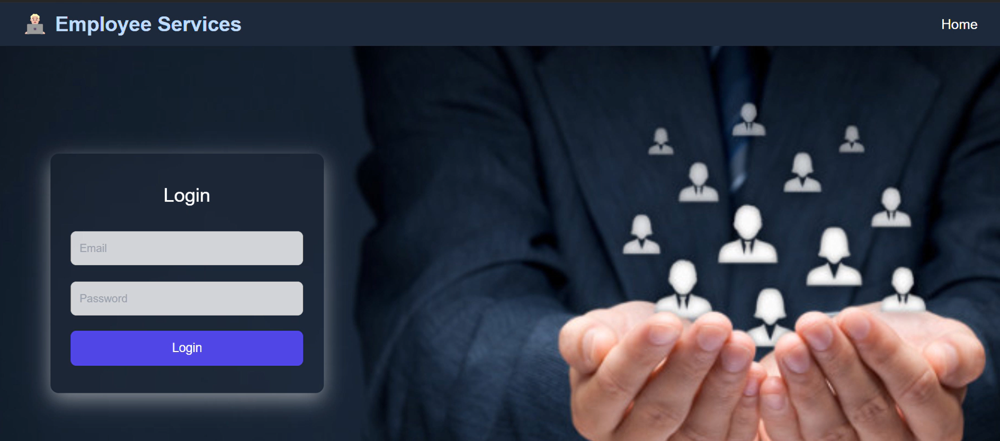
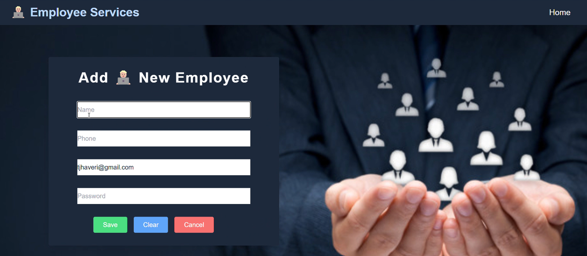
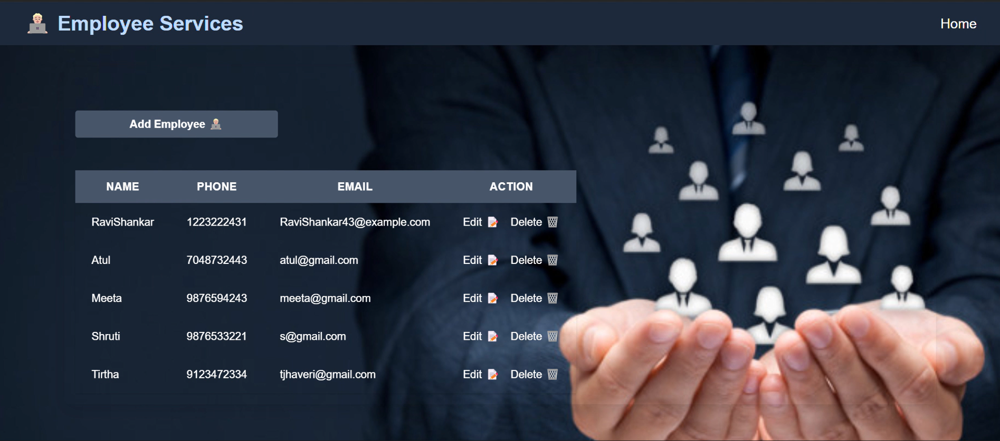
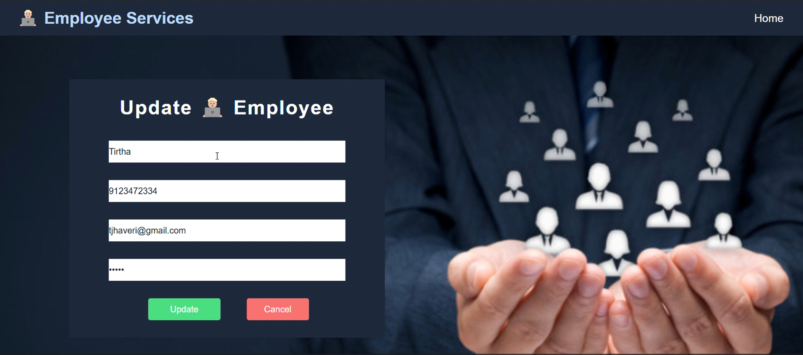

# EmployeeServices

# Overview
Employee Services is a Java Full-Stack Project built using Spring Boot, MySQL, React, JavaScript, and CSS. This project enables efficient employee management with features such as adding, deleting, and updating employee records, all easily visible in MySQL and Postman APIs.

# Features 
-  User Authentication – Login Page for secure access.
-  Employee Management – Add, Update, and Delete employees.
-  API Management – Easily handle GET, POST, PUT, and DELETE requests via Postman.
-  Frontend Tech Stack – Built with React, JS, and CSS for a smooth user interface.
-  Backend Tech Stack – Powered by Java Spring Boot and connects to MySQL.

# Tech Stack 

| Technology  | Description                          |
|------------|--------------------------------------|
| **Java**   | Backend programming language        |
| **Spring Boot** | Framework for API and backend logic |
| **MySQL**  | Database management system         |
| **React**  | Frontend framework for UI components |
| **JavaScript** | Dynamic UI functionality       |
| **CSS**    | Styling for frontend design        |
| **Postman** | API testing tool                   |

## Setup & Installation

### Backend (Spring Boot & MySQL)
1. **Clone the repository:**
   ```sh
   git clone https://github.com/yourusername/employee-services.git
   cd employee-services
 2. **Start MySQL and create a database:**
    ```sql
    CREATE DATABASE employee_db;
 3. **Update application.properties with MySQL credentials.**
 4. **Run the Spring Boot application:**
    ```sh
    mvn clean install
    mvn spring-boot:run

 ### Frontend (React)
   1. **Navigate to the React project directory:**
      ```sh
         cd emp-project-view
   2. **Install dependencies:**
      ```sh
         npm install
   3. **Start the React application:**
      ```sh
      npm start

# Postman API Collection
- Import the postman_collection.json file into Postman.
- API endpoints supported:
- GET /employees – Fetch all employees.
- POST /employees – Add a new employee.
- PUT /employees/{id} – Update employee details.
- DELETE /employees/{id} – Remove an employee.

#  Screenshots

| Page             | Screenshot                               |
|------------------|-------------------------------------------|
| Home Page        |      |
| Add Employee     |          |
| Employee List    |        |
| Update Employee  |    |

# Future Improvements 
- Add JWT-based authentication for secure access.
- Improve UI with a dashboard and employee analytics.
- Deploy the project using Docker or cloud platforms.
  
# Contributing 
- Fork the repository and create a new branch.
- Submit a Pull Request with enhancements.
- Report issues or feature requests in GitHub Issues.

# License 
- This project is open-source and free to use.

